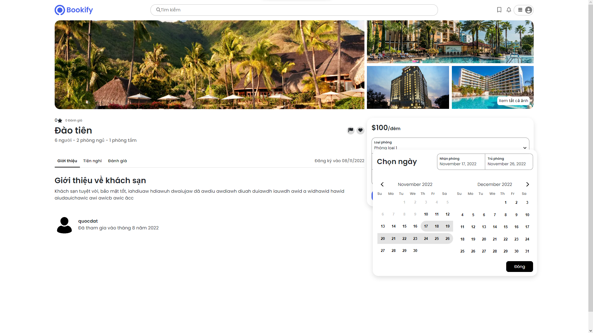

# BOOKIFY - AIRBNB Clone
## Practical project for class SWP391
### v0.1

##### Home Page

##### Hotel Page

### Bugs:
- Can not prevent user from reservation when rooms in hotel and incoming reservated room have reservated in same day.
- Profile Header Navbar can not auto close after user click on nav item one time.
- After register to become a host, role is not updated immediately.

#### Tech stacks:
- Design: Figma
- Front-end: ReactJs, MUI, Reactstrap, SCSS.
- Back-end: Java servlet, Jersey Framework.

#### Contributors:
1. Hoang Nguyen Quoc Dat:
- Database Designer
- Front-end developer (Home Page, Hotel Page, Hosting Page)
- Back-end developer
- UI designer
2. Le Quy Duc
- Database Designer 
- Front-end developer (Profile Page, Admin Page)
- Back-end developer
3. Phan Duc Thinh
- Front-end developer
- Business Analysist
4. Nguyen Nhat Huy
- Front-end developer (Profile Page, Hosting Page)
- Business Analysist
5. Ho Cong Trong Hieu
- Business Analysist

#### How to run:
- Software needed: Netbeans 13+, MSSQL Server, Apache Tomcat 9.0, SSMS, Vscode or any code editor
1. open folder `bookify-be`, run `script.sql` on ssms.
2. Then, open `bookify-be` with Netbeans IDE, then select `clean and build` on Folder Tab, then run server.
3. After that, cd to folder `bookify-fe`, open terminal, run `npm i`, then `npm start`. 
